# Отчёт по лабораторной работе №5  
## Git advanced workshop

## Цель работы

Цель лабораторной работы — изучить расширенные возможности Git: работу с локальным и удалённым репозиторием, ветками, конфликтами слияния, Git hooks и моделью ветвления Git Flow.

В ходе работы были выполнены следующие действия:

- создан и склонирован удалённый репозиторий;
- создан первый файл проекта и выполнен первый коммит;
- выполнена работа с ветками и удалённым репозиторием;
- создан и разрешён конфликт слияния;
- настроен `pre-commit` hook для проверки `.txt` файлов;
- использован Git Flow для работы с `feature`, `release` и `hotfix`;
- созданы теги релизов `v1.0.0` и `v1.0.1`.

Все действия подтверждены скриншотами из папки `images`.

---

## 1. Создание и клонирование репозитория

Сначала был создан удалённый репозиторий на GitHub. После этого репозиторий был склонирован на локальный компьютер:

```bash
git clone https://github.com/hideomiamoto/informatics-lab-5.git
cd informatics-lab-5
```

После перехода в папку проекта была выполнена проверка состояния репозитория:

```bash
git status
```

Git показал текущее состояние рабочей директории и активную ветку.

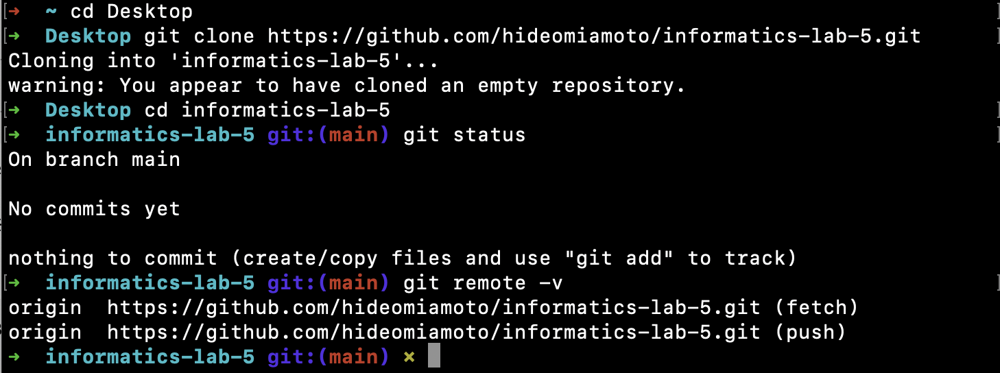

*Рисунок 4. Проверка состояния репозитория после начала работы.*

---

## 2. Создание файла `example.txt` и первый коммит

Далее был создан файл `example.txt`, в который была записана начальная структура книги.

```bash
cat > example.txt
```

После создания файла была выполнена проверка состояния:

```bash
git status
```

Git показал, что файл `example.txt` является новым неотслеживаемым файлом.

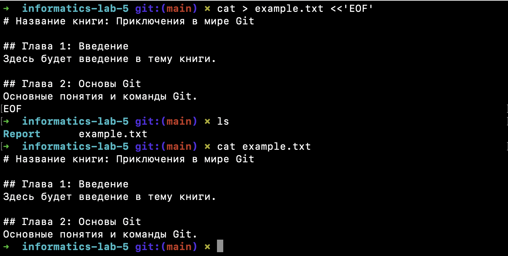

*Рисунок 5. Создание и запись файла example.txt.*

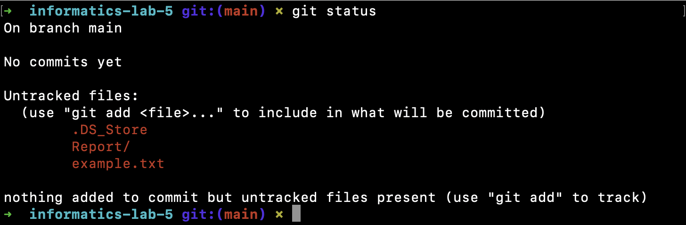

*Рисунок 6. Проверка статуса после создания example.txt.*

Файл был добавлен в индекс командой:

```bash
git add example.txt
```

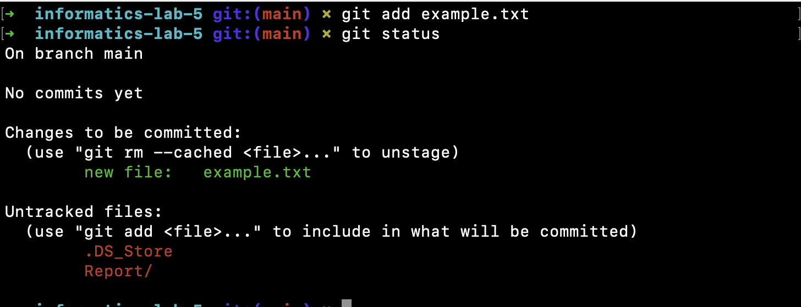

*Рисунок 7. Добавление файла example.txt в индекс.*

После этого был создан первый коммит:

```bash
git commit -m "Add initial book structure"
```

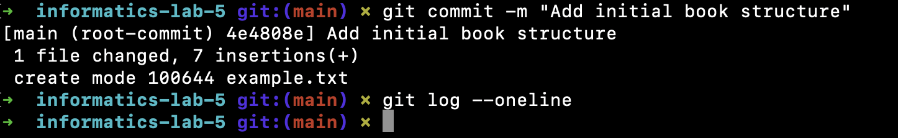

*Рисунок 8. Создание первого коммита.*

История коммитов была проверена командой:

```bash
git log --oneline
```


*Рисунок 9. Проверка истории коммитов после первого коммита.*

---

## 3. Отправка изменений в удалённый репозиторий

После первого коммита изменения были отправлены в удалённый репозиторий:

```bash
git push origin main
```

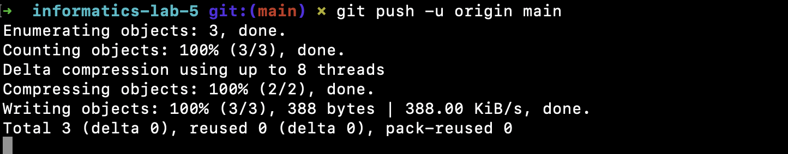

*Рисунок 10. Первый push в удалённый репозиторий.*

На GitHub появился первый коммит проекта.

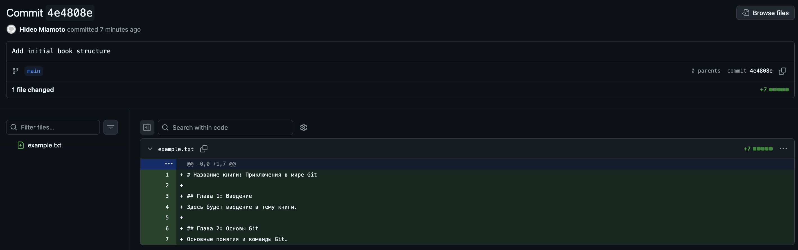

*Рисунок 11. Проверка первого коммита на GitHub.*

---

## 4. Работа с веткой `feature-branch`

Для демонстрации работы с ветками была создана новая ветка:

```bash
git checkout -b feature-branch
```

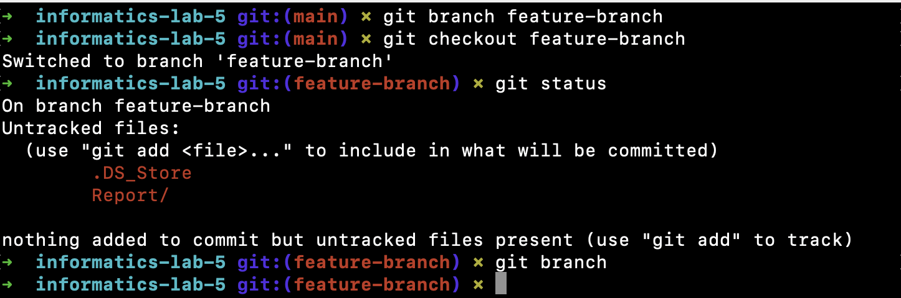

*Рисунок 12. Создание ветки feature-branch.*

После этого был проверен список веток:

```bash
git branch
```


*Рисунок 13. Проверка списка веток.*

В ветке `feature-branch` в файл `example.txt` была добавлена новая глава. Затем с помощью `git diff` была проверена разница между текущим состоянием файла и последним коммитом.

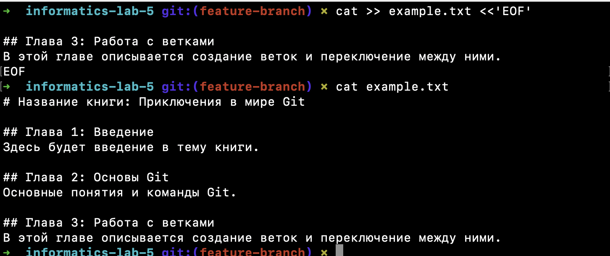

*Рисунок 14. Добавление новой главы в example.txt.*

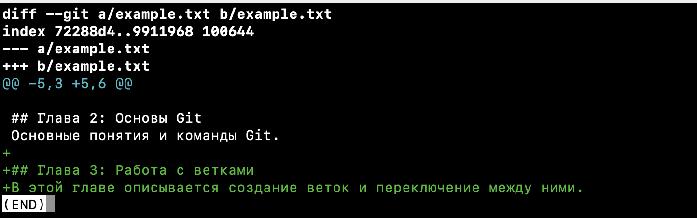

*Рисунок 15. Проверка изменений через git diff.*

Изменения были закоммичены и отправлены в удалённый репозиторий:

```bash
git add example.txt
git commit -m "Add chapter about branches"
git push origin feature-branch
```

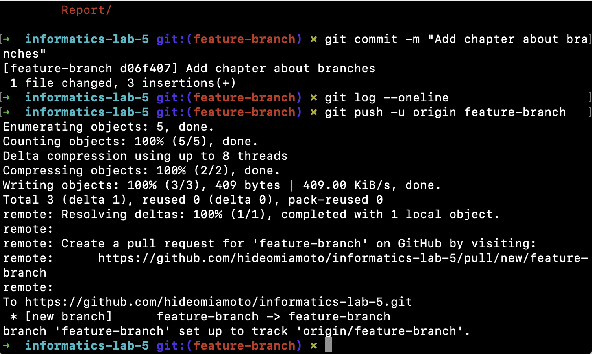

*Рисунок 19. Отправка ветки feature-branch в удалённый репозиторий.*

Затем ветка `feature-branch` была объединена с `main`:

```bash
git checkout main
git merge feature-branch
```

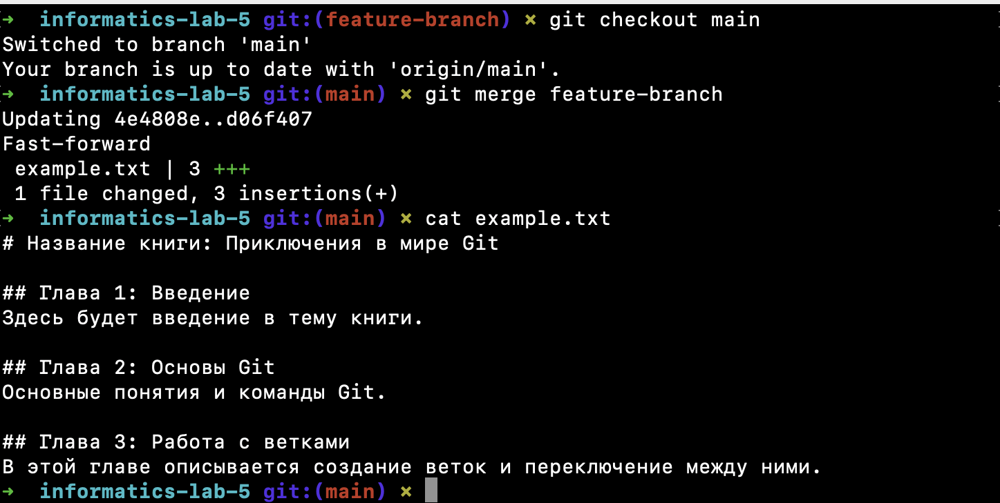

*Рисунок 20. Слияние feature-branch в main.*

После слияния была проверена история:

```bash
git log --oneline --graph --all --decorate
```

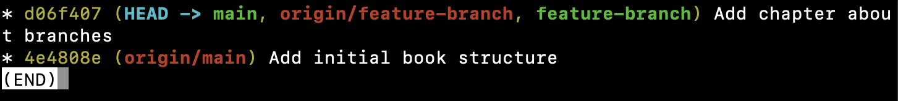

*Рисунок 21. История коммитов после слияния feature-branch.*

---

## 5. Создание `README.md` и ветки `feature-login`

Далее был создан файл `README.md` со структурой книги. Файл был добавлен в индекс и закоммичен:

```bash
git add README.md
git commit -m "Add README book structure"
```

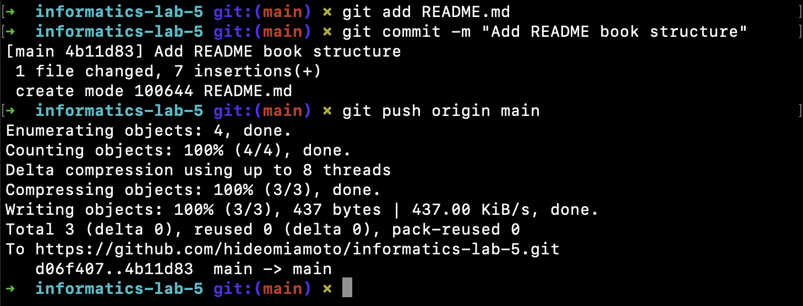

*Рисунок 24. Коммит с файлом README.md.*

После этого была создана ветка `feature-login`:

```bash
git checkout -b feature-login
```


*Рисунок 25. Создание ветки feature-login.*

Список веток был проверен повторно:

```bash
git branch
```


*Рисунок 26. Проверка веток после создания feature-login.*

В ветке `feature-login` в `README.md` была добавлена глава 3:

```md
## Глава 3: Вход в систему
Раздел по новой функциональности входа в систему.
```

---

## 6. Подготовка конфликта слияния

Для демонстрации конфликта в ветке `main` был изменён файл `README.md`: было обновлено название книги, введение и текст главы 2.

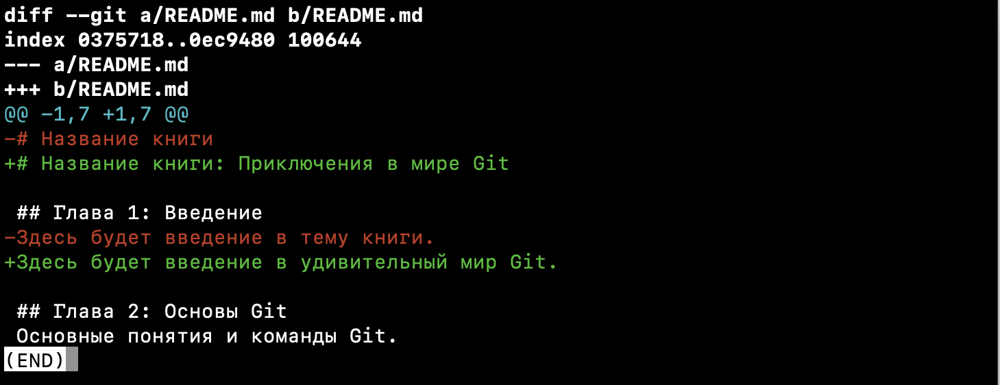

*Рисунок 32. Изменение README.md в ветке main.*

Изменения были закоммичены:

```bash
git add README.md
git commit -m "Изменено название книги и введение"
```

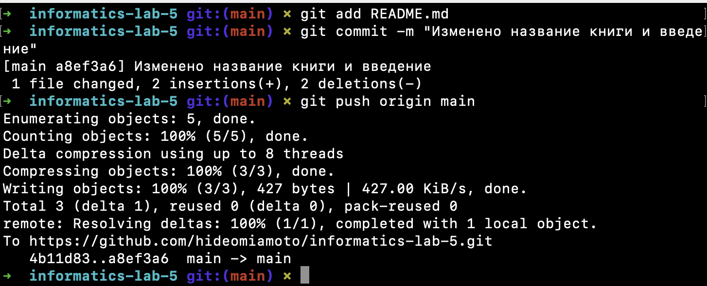

*Рисунок 33. Коммит с изменённым README.md.*

После этого была проверена история:

```bash
git log --oneline --graph --all --decorate
```

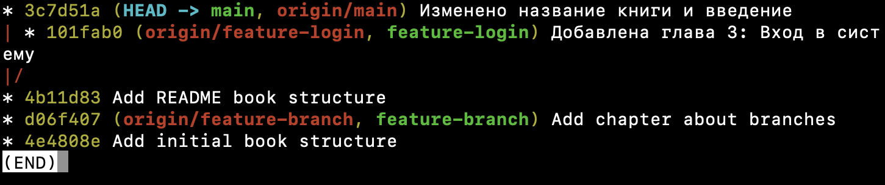

*Рисунок 34. История коммитов перед созданием конфликта.*

---

## 7. Создание и разрешение конфликта

Для объединения ветки `feature-login` с `main` была выполнена команда:

```bash
git merge feature-login
```

Git обнаружил конфликт в файле `README.md`:

```text
CONFLICT (content): Merge conflict in README.md
Automatic merge failed; fix conflicts and then commit the result.
```

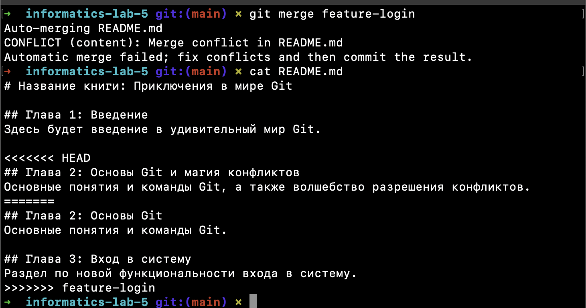

*Рисунок 38. Возникновение конфликта при слиянии feature-login в main.*

Причина конфликта заключалась в том, что один и тот же фрагмент файла `README.md` был изменён в разных ветках. В `main` была изменена глава 2, а в `feature-login` присутствовала другая версия этого же фрагмента и была добавлена глава 3.

Файл был исправлен вручную. В итоговой версии были объединены полезные изменения из обеих веток:

```md
# Название книги: Приключения в мире Git

## Глава 1: Введение
Здесь будет введение в удивительный мир Git.

## Глава 2: Основы Git и магия конфликтов
Основные понятия и команды Git, а также волшебство разрешения конфликтов.

## Глава 3: Вход в систему
Раздел по новой функциональности входа в систему.
```

После исправления конфликтных меток файл был добавлен в индекс и закоммичен:

```bash
git add README.md
git commit -m "Разрешен конфликт слияния в README.md"
```

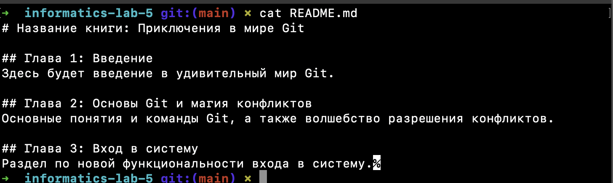

*Рисунок 39. Исправление README.md после конфликта.*

История была проверена повторно:

```bash
git log --oneline --graph --all --decorate
```

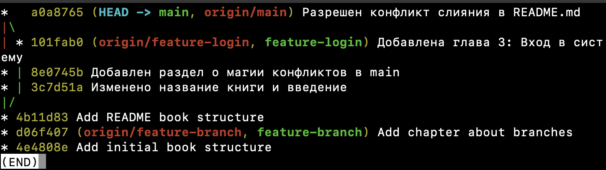

*Рисунок 40. История коммитов после разрешения конфликта.*

---

## 8. Настройка `pre-commit` hook

Для автоматизации проверки формата файлов был создан скрипт `check_format.sh`.

В рамках работы была задана простая спецификация формата `.txt` файлов:

1. Проверяются только файлы с расширением `.txt`.
2. Файл не должен быть пустым.
3. В конце строк не должно быть лишних пробелов или табуляций.

Скрипт использует `grep`, потому что эта утилита позволяет искать строки по шаблону. Например:

```bash
grep -n '[[:blank:]]$' "$file"
```

Эта команда ищет строки, которые заканчиваются пробелом или табуляцией.

Скрипт был скопирован в папку `.git/hooks` под именем `pre-commit`, после чего ему были выданы права на выполнение:

```bash
cp check_format.sh .git/hooks/pre-commit
chmod +x .git/hooks/pre-commit
ls -l .git/hooks/pre-commit
```

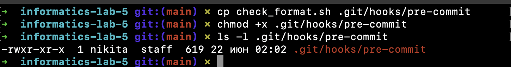

*Рисунок 41. Копирование check_format.sh в .git/hooks/pre-commit и выдача прав на выполнение.*

В выводе команды `ls -l` видны права:

```text
-rwxr-xr-x
```

Буква `x` означает, что скрипт является исполняемым.

Для проверки работы hook был создан файл `bad_format.txt` с ошибкой форматирования — пробелами в конце строки. При попытке коммита hook заблокировал операцию:

```bash
git add bad_format.txt
git commit -m "Проверка pre-commit hook"
```

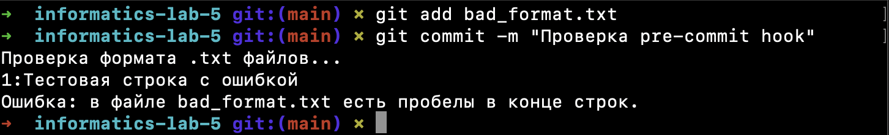

*Рисунок 42. Pre-commit hook заблокировал коммит из-за ошибки форматирования.*

После этого сам скрипт `check_format.sh` был добавлен в репозиторий и отправлен на GitHub:

```bash
git add check_format.sh
git commit -m "Добавлен скрипт проверки формата"
git push origin main
```

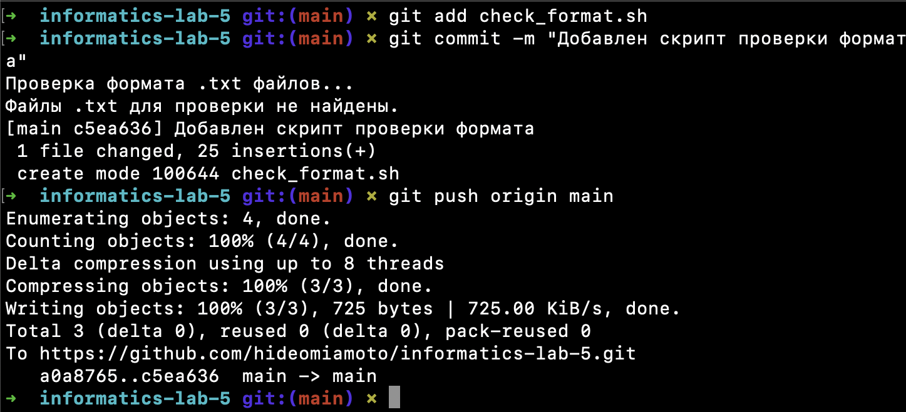

*Рисунок 43. Коммит и push скрипта check_format.sh.*

---

## 9. Инициализация Git Flow

Для работы по модели Git Flow была проверена версия инструмента:

```bash
git flow version
```

После этого была выполнена команда:

```bash
git flow init
```

На первом запуске возникла ситуация, когда ветка `develop` ещё не существовала, поэтому Git Flow не смог использовать её как ветку разработки.

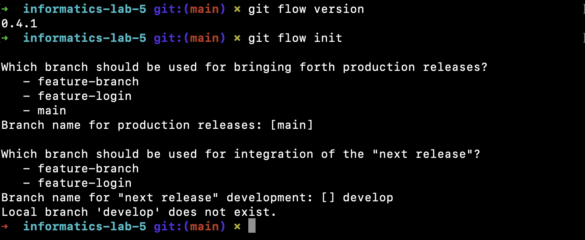

*Рисунок 44. Попытка инициализации Git Flow без существующей ветки develop.*

Ветка `develop` была создана вручную:

```bash
git branch develop
```

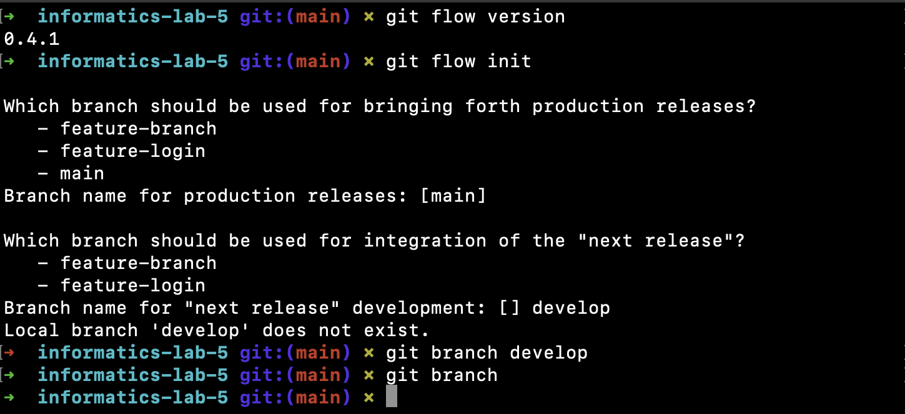

*Рисунок 45. Создание ветки develop.*

После этого Git Flow был инициализирован с использованием `main` как production-ветки и `develop` как ветки разработки.


*Рисунок 46. Проверка веток после инициализации Git Flow.*

Ветка `develop` была отправлена в удалённый репозиторий:

```bash
git push -u origin develop
```

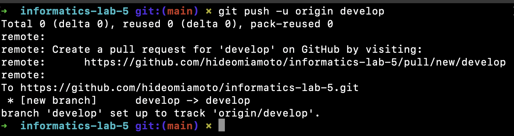

*Рисунок 48. Отправка ветки develop в удалённый репозиторий.*

---

## 10. Работа с feature-веткой через Git Flow

Для добавления нового функционала была создана feature-ветка:

```bash
git checkout develop
git flow feature start task-management
```

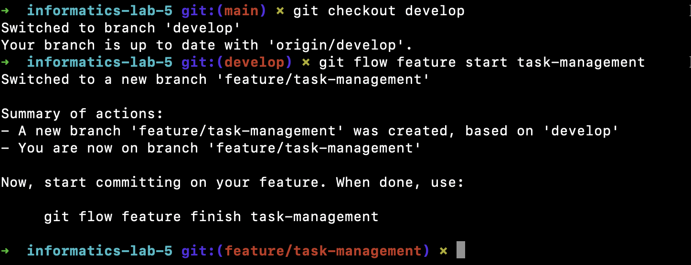

*Рисунок 49. Создание feature-ветки task-management через Git Flow.*

В этой ветке был создан файл `task_manager.py`:

```python
def create_task(title, description):
    # Логика создания задачи
    print(f"Создана новая задача: {title}")
```

Файл был добавлен в индекс и закоммичен:

```bash
git add task_manager.py
git commit -m "Добавлен функционал управления задачами"
```

После этого feature-ветка была завершена:

```bash
git flow feature finish task-management
```

Git Flow автоматически вернул изменения в `develop` и удалил временную ветку `feature/task-management`.

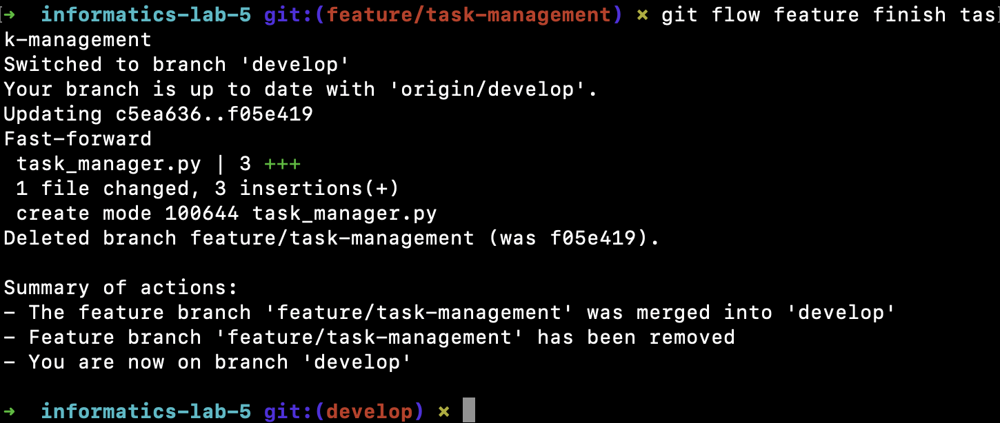

*Рисунок 50. Завершение feature-ветки task-management.*

---

## 11. Создание release-ветки `v1.0.0`

Для подготовки релиза была создана release-ветка:

```bash
git flow release start v1.0.0
```

В рамках релиза был создан файл версии:

```bash
echo "v1.0.0" > version.txt
cat version.txt
```

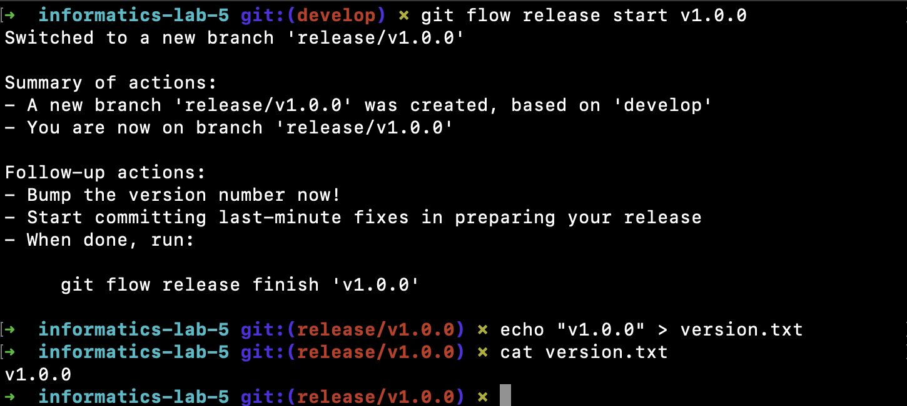

*Рисунок 51. Создание release-ветки v1.0.0 и файла version.txt.*

После этого файл `version.txt` был добавлен в индекс и закоммичен:

```bash
git add version.txt
git commit -m "Обновлена версия для релиза v1.0.0"
```

При завершении релиза командой:

```bash
git flow release finish v1.0.0
```

открылся редактор Vim для сообщения merge-коммита.

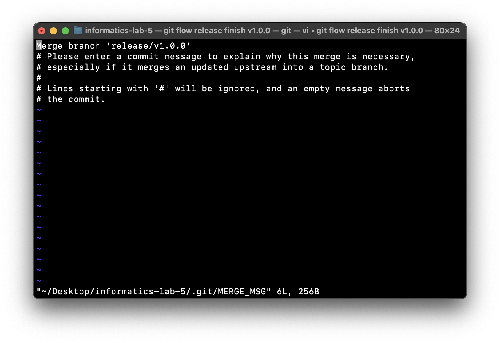

*Рисунок 52. Редактор Vim при завершении release-ветки.*

Из-за особенности установленной версии `git-flow` автоматическое создание тега завершилось ошибкой. Поэтому релиз был доведён до корректного состояния вручную:

```bash
git tag -a v1.0.0 -m "Release v1.0.0"
git checkout develop
git merge --no-ff release/v1.0.0 -m "Merge release v1.0.0 into develop"
git branch -d release/v1.0.0
```

После этого были проверены ветки, теги и история. В результате появился тег `v1.0.0`, а временная ветка `release/v1.0.0` была удалена.

---

## 12. Создание hotfix-ветки `v1.0.1`

После релиза была смоделирована ситуация обнаружения критической ошибки. Ошибка заключалась в том, что функция создания задачи позволяла создать задачу без названия.

Для исправления была создана hotfix-ветка:

```bash
git checkout main
git flow hotfix start v1.0.1
```

В файл `task_manager.py` была добавлена проверка пустого названия задачи:

```python
def create_task(title, description):
    if not title:
        raise ValueError("Название задачи не может быть пустым")

    # Логика создания задачи
    print(f"Создана новая задача: {title}")
```

Изменение было закоммичено:

```bash
git add task_manager.py
git commit -m "Исправлена критическая ошибка создания задачи"
```

При завершении hotfix у установленной версии `git-flow` возникла такая же проблема с автоматическим созданием тега. Поэтому hotfix был завершён вручную:

```bash
git tag -a v1.0.1 -m "Release v1.0.1"
git checkout develop
git merge --no-ff hotfix/v1.0.1 -m "Merge hotfix v1.0.1 into develop"
git branch -d hotfix/v1.0.1
```

После проверки было видно, что:

- тег `v1.0.1` создан;
- временная ветка `hotfix/v1.0.1` удалена;
- исправление попало в `main`;
- исправление было возвращено в `develop`.

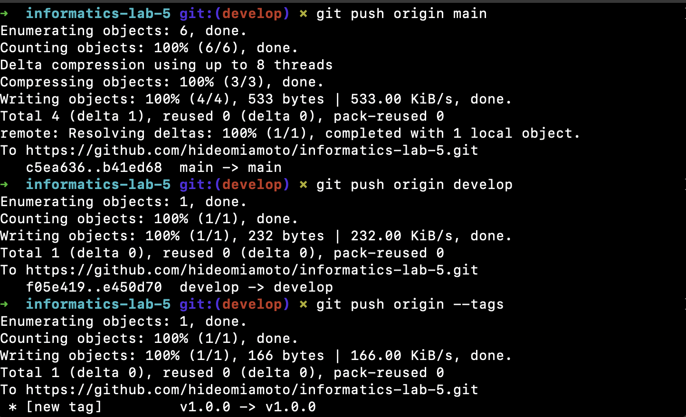

*Рисунок 55. Проверка тегов v1.0.0 и v1.0.1.*

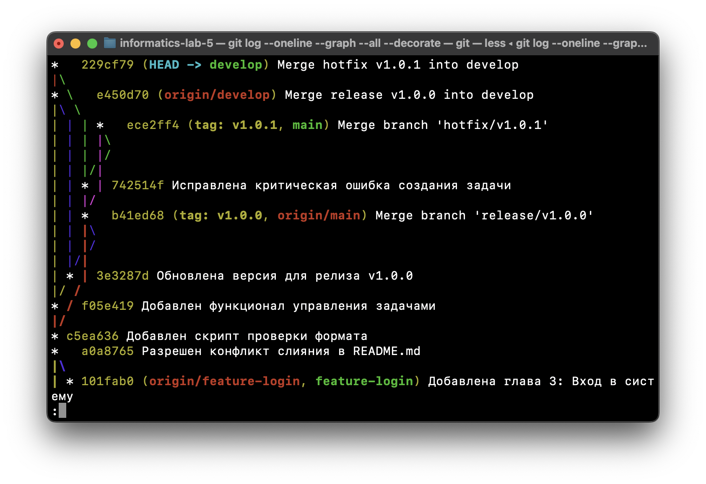

*Рисунок 56. Финальная история после завершения hotfix.*

---

## 13. Отправка итоговых веток и тегов на GitHub

После завершения `release` и `hotfix` изменения были отправлены в удалённый репозиторий:

```bash
git push origin main
git push origin develop
git push origin --tags
```

Таким образом, на GitHub были опубликованы основные ветки проекта и теги релизов `v1.0.0` и `v1.0.1`.

---

## 14. Итоговая история проекта

Финальная история была проверена командой:

```bash
git log --oneline --graph --all --decorate
```

В истории проекта видно:

- ветку `main`;
- ветку `develop`;
- merge-коммит релиза `v1.0.0`;
- merge-коммит hotfix `v1.0.1`;
- теги `v1.0.0` и `v1.0.1`;
- ранее созданные feature-ветки;
- коммиты, связанные с разрешением конфликта и настройкой hook.


*Рисунок 56. Финальная история Git с release и hotfix.*

---

## Вывод

В ходе лабораторной работы были изучены и применены расширенные возможности Git.

Была выполнена работа с локальным и удалённым репозиторием, созданы и объединены ветки, смоделирован и разрешён конфликт слияния. Также был создан `pre-commit` hook для автоматической проверки `.txt` файлов перед коммитом.

Отдельно была изучена модель Git Flow. С её помощью были созданы `feature`, `release` и `hotfix` ветки. В процессе работы возникла особенность, связанная со старой версией `git-flow`: автоматическое создание тегов при завершении `release` и `hotfix` завершалось ошибкой. Поэтому соответствующие этапы были корректно доведены вручную стандартными командами Git.

В результате были закреплены навыки работы с ветками, merge-коммитами, тегами, Git hooks и Git Flow.
